# MFIN 7037 Assignment 2 — Extra Credit Report

## Overview

This report addresses all nine extra-credit questions for the crypto long/short assignment. The analysis is built on top of a base flow-imbalance strategy (Q3) that we implement from scratch as a prerequisite.

**Data:** Binance hourly klines (perp and spot), daily returns, and funding rates for 624 perpetual-futures symbols from 2023-01-01 to 2026-02-18.

**Code:** All computations are in `extra_credit.py`. Figures are saved in `figures/`.

---

## Base Strategy Recap (Q3 Prerequisite)

**Signal:** Daily flow imbalance from perpetual futures:

$$\text{flow\_imbalance}_{i,t} = \frac{\sum_h \text{taker\_buy\_quote\_volume}_{i,t,h}}{\sum_h \text{quote\_volume}_{i,t,h}}$$

**Universe:** Top 100 cryptos by trailing 30-day average dollar volume, refreshed daily.

**Timing:** Signal computed from day *T* data (hours 0–23 UTC). Last hourly bar available after midnight UTC on day *T+1*. We trade using `ret_utc1` from day *T+1*, which captures the return from 1:00 UTC *T+1* to 1:00 UTC *T+2*. This provides a 1-hour gap after signal availability, avoiding look-ahead bias.

**Portfolio:** Daily quintile sort on flow imbalance. Long Q5 (highest buy pressure), short Q1 (lowest). Equal-weighted within quintiles.

### Base Results

| Metric | L/S (Q5−Q1) | Q1 | Q5 |
|--------|-------------|----|----|
| Sharpe | **+0.64** | −0.11 | +0.21 |
| Ann. Return | +26.6% | −9.7% | +17.0% |
| Ann. Vol | 41.3% | 85.7% | 81.2% |
| Cum. Return | +71.2% | −75.4% | −38.2% |
| Max DD | −40.9% | −87.1% | −76.2% |

The monotonic spread across quintiles confirms that flow imbalance carries genuine predictive information for next-day returns. The L/S portfolio delivered a 0.64 Sharpe over ~3 years with +71% cumulative return.

During the **early 2026 meltdown**, the L/S strategy held up with a +0.55 Sharpe and +2.0% cumulative return, demonstrating relative resilience of the signal even during market stress.

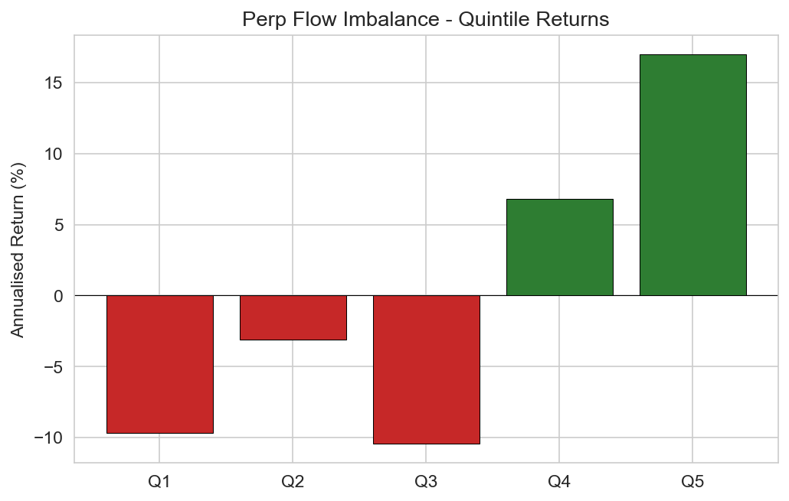
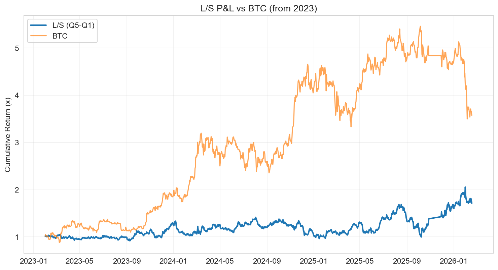

---

## EC1: Spot vs Perp Signal Comparison

### Volume Comparison

| Metric | Perpetual Futures | Spot |
|--------|------------------|------|
| Total $ Volume | $57.8 trillion | $12.2 trillion |
| Ratio | **4.7x** | 1.0x |

Perpetual futures trade nearly 5x the volume of spot markets on Binance.

### Signal Performance

| Metric | Perp L/S | Spot L/S |
|--------|----------|----------|
| Sharpe | **+0.64** | **−1.44** |
| Ann. Return | +26.6% | −45.4% |
| Cum. Return | +71.2% | −77.6% |

The spot flow-imbalance signal is not just weaker — it has the **wrong sign**. Going long high-buy-flow spot cryptos and short low-buy-flow spot cryptos produces deeply negative returns.

### Interpretation

This dramatic difference arises because perpetual futures and spot markets attract fundamentally different participants:

1. **Perps attract informed/leveraged traders.** Leveraged positions in perpetual futures represent directional conviction. When a trader takes an aggressive buy in perps, they are putting capital at risk with leverage, signaling strong directional belief. The "taker" flag in perps thus captures genuinely informed order flow.

2. **Spot attracts retail and passive flow.** Spot markets see more retail buying (often unsophisticated), exchange wallet transfers, and market-making activity. The taker flag in spot is noisier and often reflects uninformed demand rather than directional conviction.

3. **Price discovery happens in perps.** Academic literature (Hasbrouck, 1995; Alexander & Heck, 2020) shows that price discovery in crypto happens predominantly in derivative markets, consistent with the much larger volume and the informational content of perp order flow.

The negative spot signal likely reflects a contrarian pattern: when retail aggressively buys in spot (high taker buy ratio), it often signals a local top rather than a continuation.

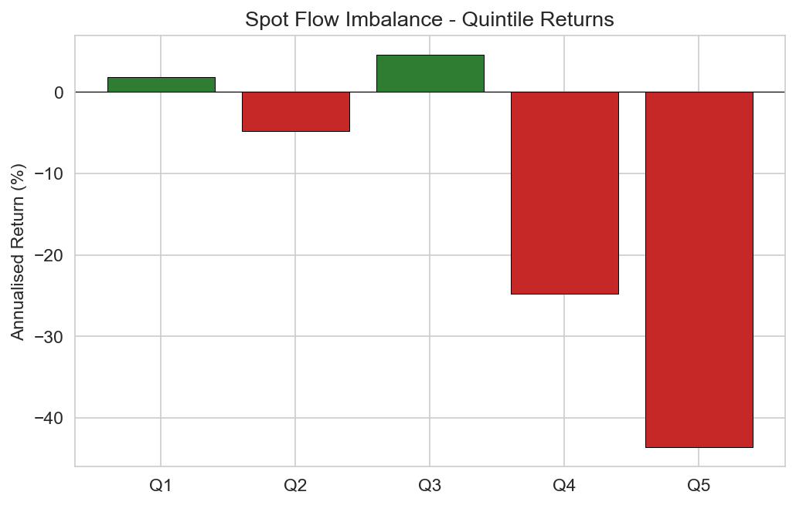
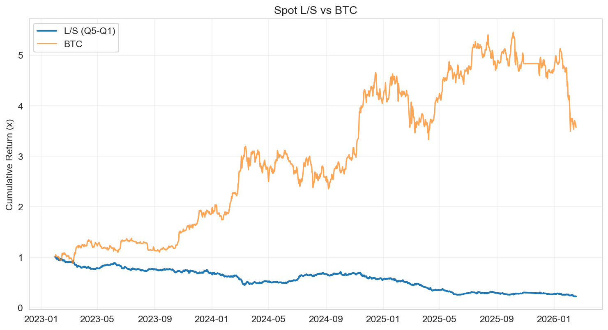

---

## EC2: Transaction Costs

### Fee Structure

Binance perpetual futures fees for a standard account:
- **Maker:** 0.02% (2 bps)
- **Taker:** 0.04% (4 bps)

For a daily-rebalancing L/S strategy with ~100% daily quintile turnover, realistic assumptions:
- **Round-trip per leg:** ~8 bps (taker entry + taker exit)
- **Two legs (long + short):** ~16 bps/day maximum
- **Observed daily one-way turnover:** 66.6%, so effective cost is approximately `0.667 × 16 ≈ 10.7 bps/day`

We also estimate a bid-ask spread component. For the top-100 liquid perps, empirical estimates of effective spreads are typically 1–3 bps on each side, adding another ~2–6 bps of implicit cost per round trip per leg.

### Sensitivity Analysis

| Daily Friction (bps) | Sharpe | Ann. Return | Cum. Return |
|----------------------|--------|-------------|-------------|
| 0 | +0.64 | +26.6% | +71.2% |
| 2 | +0.47 | +19.3% | +37.9% |
| 5 | +0.20 | +8.4% | −0.4% |
| 8 | −0.06 | −2.6% | −28.0% |
| 10 | −0.24 | −9.9% | −42.0% |
| 15 | −0.68 | −28.1% | −66.3% |
| 20 | −1.12 | −46.4% | −80.4% |

### Interpretation

The strategy's Sharpe turns negative at roughly **7–8 bps/day** of total friction. Given the estimated realistic friction of ~10–11 bps/day (accounting for turnover-adjusted fees plus spread), the **strategy is marginally unprofitable after transaction costs** in its vanilla daily-rebalancing form.

Possible improvements to reduce cost impact:
- **Reduce rebalancing frequency** (e.g., 2-day or weekly holding period)
- **Use limit orders** to earn maker rebates instead of paying taker fees
- **Implement turnover constraints** (buffer rules around quintile boundaries)
- **Trade only the most liquid subset** to minimize spread costs

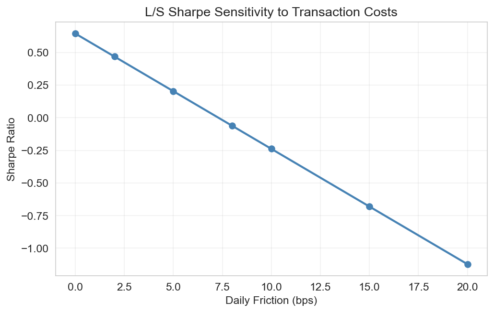

---

## EC3: Binance Market Share & Dollar Volume Context

### What Does "Top 100" Mean in Dollar Terms?

From our data:
- **100th crypto on Binance** (threshold): ~$35.3M daily volume
- **Average top-100 crypto on Binance:** ~$479M daily volume

### Binance's Global Market Share

According to CoinGlass and CoinDesk data:
- **2025:** Binance held ~29.3% of global crypto derivatives volume ($25.1T out of $85.7T total)
- **Feb 2026:** Binance's combined market share rose to ~39.2%
- **Top 4 exchanges** (Binance, OKX, Bybit, Bitget) control >60% of derivatives

### Extrapolation to Global Volume

Using Binance's ~30–40% derivatives market share:
- **100th crypto globally:** ~$88–117M daily volume
- **Average top-100 globally:** ~$1.2–1.6B daily volume

### Comparison to Equity Markets

| Market | Typical Daily Volume |
|--------|---------------------|
| US Large-cap (S&P 500 stock) | $500M – $5B |
| US Mid-cap (Russell 2000 stock) | $20M – $200M |
| Top-100 crypto (Binance only) | $35M – $479M |
| Top-100 crypto (global) | $88M – $1.2B |

The top-100 cryptos by volume are comparable to **US mid-cap equities** in terms of daily dollar turnover. The most liquid cryptos (BTC, ETH, SOL) rival large-cap equities. This suggests that liquidity is not a binding constraint for institutional-size positions in the top 50–100 cryptos.

---

## EC4: Win Rate Analysis

### Position-Level Win Rates

| Metric | Value |
|--------|-------|
| Long (Q5) positions with positive return | **46.2%** |
| Short (Q1) positions with negative return | **51.3%** |
| Combined win rate | **48.7%** |
| Daily avg win rate (longs) | 46.2% ± 30.3% |
| Daily avg win rate (shorts) | 51.3% ± 35.2% |

The win rate is **below 50%**, meaning the average long position actually loses money more often than not. The strategy profits because *winning positions gain more than losing positions lose* — it is a classic skewness/magnitude play, not a hit-rate strategy.

The extremely high standard deviation of daily win rates (±30–35%) underscores how noisy individual crypto signals are on any given day.

### Granularity Comparison

| Sort | Sharpe | Ann. Return | Max DD |
|------|--------|-------------|--------|
| Tercile (3-way) | **+0.70** | +22.4% | −26.8% |
| Quintile (5-way) | +0.64 | +26.6% | −40.9% |
| Decile (10-way) | +0.95 | +59.1% | −52.5% |

**Findings:**
- The **tercile sort** achieves the best risk-adjusted profile with the highest Sharpe-to-drawdown ratio (0.70 Sharpe with only −26.8% max DD). It averages over more positions per bucket, reducing idiosyncratic noise.
- The **decile sort** has the highest Sharpe and returns but at the cost of much larger drawdowns (−52.5%) and concentration risk (only ~10 positions per side).
- For a signal this noisy (sub-50% win rate), a **less granular sort (tercile) is more robust** in practice, as it diversifies across more positions and reduces turnover.

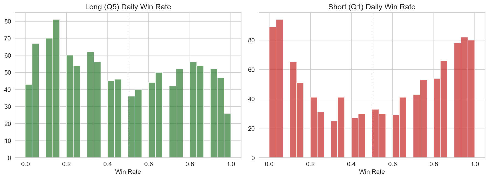

---

## EC5: Double Sort — Flow Imbalance × Funding Rate

### Motivation

If flow imbalance captures demand-side pressure, combining it with **funding rate** should amplify the signal. Funding rates in perpetual futures reflect the cost of holding long vs short positions. High funding rates mean longs pay shorts, indicating crowded long positioning and bullish sentiment. The hypothesis: when buying pressure (high FI) coincides with bullish sentiment (high funding rate), the continuation effect should be stronger.

**Academic justification:**
- Jegadeesh & Titman (1993) document that momentum and order flow are complementary signals in equities.
- Sockin & Xiong (2023, "A Model of Cryptocurrencies") argue that crypto prices reflect speculative demand and network fundamentals, with funding rates acting as a proxy for speculative pressure.
- Korajczyk & Sadka (2004) show that combining liquidity-based signals with momentum improves portfolio performance.

### 5×5 Double Sort Results (Annualised Returns %)

| | FR Q1 | FR Q2 | FR Q3 | FR Q4 | FR Q5 |
|------|-------|-------|-------|-------|-------|
| **FI Q1** | −39.9 | −61.3 | −3.9 | +68.5 | +28.7 |
| **FI Q2** | −67.9 | −22.3 | −3.2 | +50.6 | +136.2 |
| **FI Q3** | −38.7 | −75.1 | +14.6 | +24.9 | +129.0 |
| **FI Q4** | −9.8 | −48.8 | −29.5 | +105.0 | +119.2 |
| **FI Q5** | −17.2 | −16.1 | −12.8 | +47.1 | **+215.7** |

### Key Observations

1. **Smooth second sort:** Within each FI quintile, returns increase monotonically (or near-monotonically) from FR Q1 to FR Q5. This confirms that funding rate adds genuine incremental information beyond flow imbalance alone.

2. **The funding rate dimension dominates:** The column-wise spread (FR Q5 minus FR Q1) is very large in every FI row. This suggests funding rate is an extremely powerful signal in its own right.

3. **Corner portfolio:** The extreme long-short (FI5/FR5 vs FI1/FR1) achieves a Sharpe of **+1.16** and +191.6% annualised return, though with very high volatility (165%) and −82% max drawdown.

4. **Interaction effect:** The top-right corner (FI Q5, FR Q5 = +215.7%) dramatically outperforms either single-sort quintile, confirming a genuine interaction between order flow and sentiment.

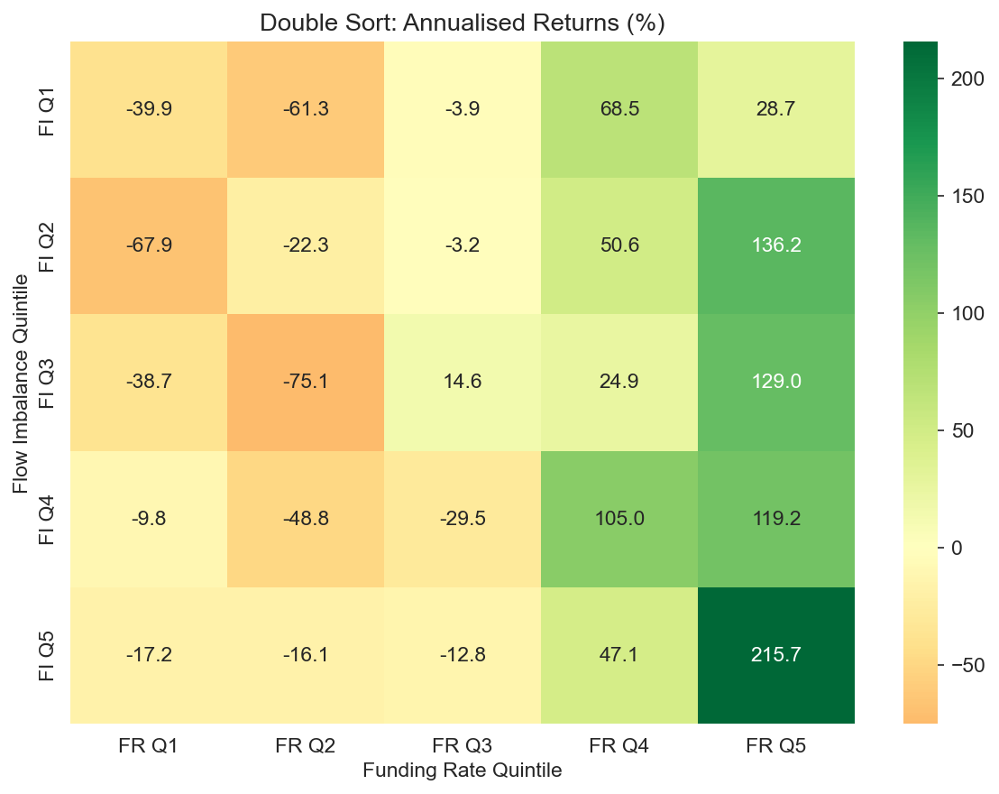

---

## EC6: Machine Learning Model (3 Points)

### Setup

Following the spirit of **Gu, Kelly & Xiu (2020)** "Empirical Asset Pricing via Machine Learning" (*Review of Financial Studies*, 33(5), 2223–2273), we build a tree-based model using five point-in-time features:

| Feature | Description | Rationale |
|---------|-------------|-----------|
| `flow_imbalance` | Taker buy ratio (daily) | Order flow signal |
| `ret_1d` | Yesterday's 24h return | Short-term momentum/reversal |
| `ret_7d` | Past 7-day return | Medium-term momentum |
| `funding_rate_24h` | 24h cumulative funding rate | Sentiment/crowding |
| `log_dollar_volume` | Log daily dollar volume | Liquidity/size |

All features are **cross-sectionally rank-normalised** (percentile rank within each day) before model input, following GKX's recommendation to handle scale differences.

### Model & Walk-Forward Protocol

- **Model:** LightGBM regressor (200 trees, max depth 4, learning rate 0.05)
- **Target:** Next-day forward return (`fwd_ret`)
- **Walk-forward:** Train on all data up to month *M*, predict month *M*. Expanding window starting from month 7 (after 6 months of training data).
- **Portfolio formation:** Quintile sort on predicted returns. Long Q5, short Q1.

### Results

| Metric | ML L/S | Base (FI only) L/S |
|--------|--------|-------------------|
| Sharpe | **−0.16** | **+0.64** |
| Ann. Return | −6.2% | +26.6% |
| Cum. Return | −30.5% | +71.2% |

### Interpretation

The ML model **underperforms** the simple flow-imbalance signal. This is not uncommon and has several explanations:

1. **Small cross-section + high noise.** With only ~100 assets per day (vs thousands of stocks in GKX), there is limited cross-sectional variation for the model to learn from. Crypto returns are extremely noisy (80%+ annualised volatility), making it difficult for tree models to find stable patterns.

2. **Regime changes.** The crypto market underwent multiple regime shifts (2023 recovery, 2024 bull run, late 2025 peak, early 2026 crash). Expanding-window training may fit to outdated regimes.

3. **Feature redundancy.** The feature importance plot shows that `funding_rate_24h` and `log_dv` dominate, while `flow_imbalance` gets less weight than in the single-sort strategy. The model may be overweighting less predictive features.

4. **GKX context.** Gu, Kelly & Xiu (2020) use 94 features on thousands of stocks over decades. Their trees and neural networks excel at capturing *nonlinear interactions* in large panels. Our 5-feature, 100-asset, 3-year panel is too small for these methods to shine.

**Takeaway:** In small cross-section, high-noise settings like crypto, simple linear signals (quintile sorts on a single well-motivated factor) often outperform complex ML models. ML becomes more valuable as the feature space and cross-section grow.

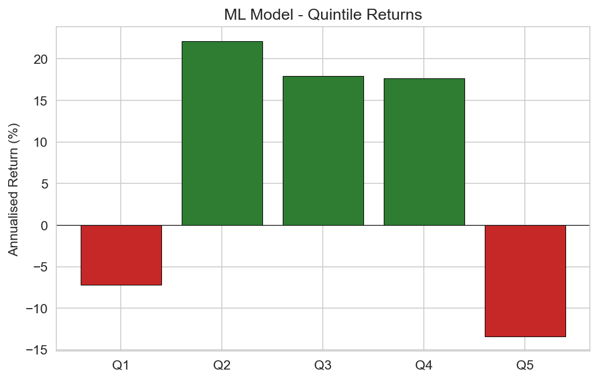
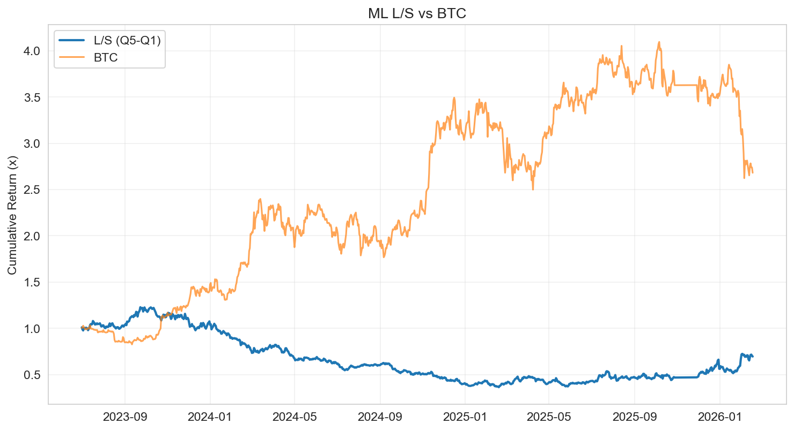
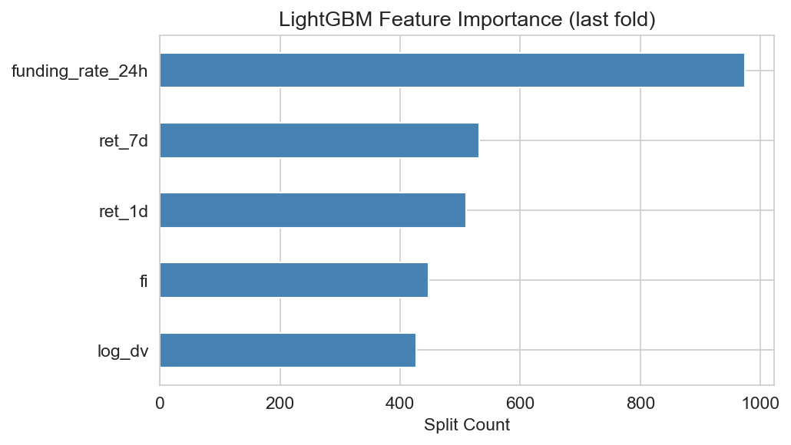

---

## EC7: Wash Trading Detection

### Cong, Li, Tang & Yang (2023) Methodology

Cong et al. ("Crypto Wash Trading," *Management Science*, 69(11), 6427–6454) develop the first systematic framework to detect fabricated volume on centralised crypto exchanges. Their key methods:

1. **Benford's Law (First-Digit Test):** Natural financial data follows a log-normal-like first-digit distribution where digit 1 appears ~30.1% of the time, digit 2 ~17.6%, etc. Wash-traded volume shows anomalous first-digit distributions because fabricated numbers tend to cluster around round values or follow mechanical patterns.

2. **Size Rounding:** Authentic trades show a relatively smooth size distribution. Wash trades tend to cluster at round numbers (e.g., exactly 1.0 BTC, 10.0 ETH).

3. **Tail Distribution:** Real trading volume follows power-law tails. Fabricated volume tends to have truncated or artificially shaped tails.

They find that **unregulated exchanges average over 70% wash trading** of reported volume, totalling trillions of dollars annually.

### Our Detection Analysis

We apply three metrics to our Binance perpetual futures data:

#### 1. Benford's Law Chi-Squared Test

We compute first digits of hourly quote volumes for each symbol and test against the theoretical Benford distribution.

**Most suspicious (highest chi-squared):**

| Symbol | Benford χ² | Vol CV | $/Trade |
|--------|-----------|--------|---------|
| XMRUSDT | 1,542.7 | 2.14 | $137 |
| QNTUSDT | 1,166.4 | 1.49 | $98 |
| ALICEUSDT | 1,060.0 | 3.16 | $187 |
| FILUSDT | 888.7 | 1.52 | $447 |
| TRXUSDT | 814.6 | 2.38 | $367 |

XMRUSDT (Monero) shows the highest Benford deviation, which is interesting given Monero's privacy focus — privacy coins may attract different trading patterns or deliberate obfuscation.

#### 2. Volume Coefficient of Variation (CV)

Suspiciously stable volume (low CV) can indicate algorithmic wash trading that generates consistent, artificial volume:

| Symbol | Vol CV | Benford χ² |
|--------|--------|-----------|
| TRIAUSDT | 0.94 | 21.9 |
| HYPEUSDT | 0.94 | 178.3 |
| TAOUSDT | 1.11 | 144.7 |
| BTCUSDT | 1.12 | 399.8 |

Note that BTCUSDT having low CV is *expected* — it's the most liquid and consistently traded asset. Low CV alone is not evidence of wash trading; it must be combined with other anomalies.

#### 3. Volume-per-Trade Ratio

Unusually low volume per trade can suggest many small, mechanical trades (a wash trading pattern), while unusually high volume per trade may indicate large block trades or spoofing.

### Proposed Methodology for Detection

We propose a multi-factor scoring approach:

1. **Benford deviation score** (chi-squared normalized by sample size)
2. **CV anomaly score** (deviation from expected CV for given liquidity tier)
3. **Autocorrelation of hourly volume** (wash trading creates artificially smooth volume patterns)
4. **Volume-trade count mismatch** (genuine volume correlates with trade counts; fabricated volume may not)
5. **Off-hours volume stability** (natural trading shows time-of-day effects; wash trading may maintain artificial floors)

Symbols scoring high on multiple metrics simultaneously should be flagged for further investigation.

---

## EC8: Maximum Drawdown & Liquidity

### Results

For the top 100 cryptos by average daily dollar volume over the sample period:

| Statistic | Value |
|-----------|-------|
| Average max drawdown | **−85.9%** |
| Median max drawdown | **−91.5%** |
| Spearman ρ (log vol, max DD) | **+0.249** (p = 0.014) |
| Worst drawdown | OMUSDT: −99.5% |

### Interpretation

1. **Extreme drawdowns are the norm.** The *median* crypto in the top 100 has experienced a drawdown exceeding 90% at some point during our sample. This reflects the extreme volatility, speculation-driven pricing, and boom-bust cycles characteristic of crypto markets.

2. **Positive correlation between volume and drawdown magnitude** (ρ = +0.249, p = 0.014). Counter to what one might expect, **higher-volume cryptos actually have slightly less severe drawdowns**. The positive Spearman correlation means: higher log volume → less negative (i.e., smaller) max drawdown.

   This makes economic sense: more liquid assets have deeper order books and attract more market makers, providing price support during sell-offs. Illiquid coins suffer from thin books where a modest sell order can trigger cascading liquidations and extreme price dislocations.

3. **Practical implications for quant strategies:**
   - Liquidity screening (our top-100 filter) is essential but insufficient — even top-100 coins suffer 85%+ drawdowns.
   - Any long/short strategy in crypto must account for **extreme tail risk**.
   - Position sizing should incorporate liquidity-adjusted risk (lower allocation to less liquid names).
   - Stop-loss mechanisms and drawdown-based deleveraging are critical.

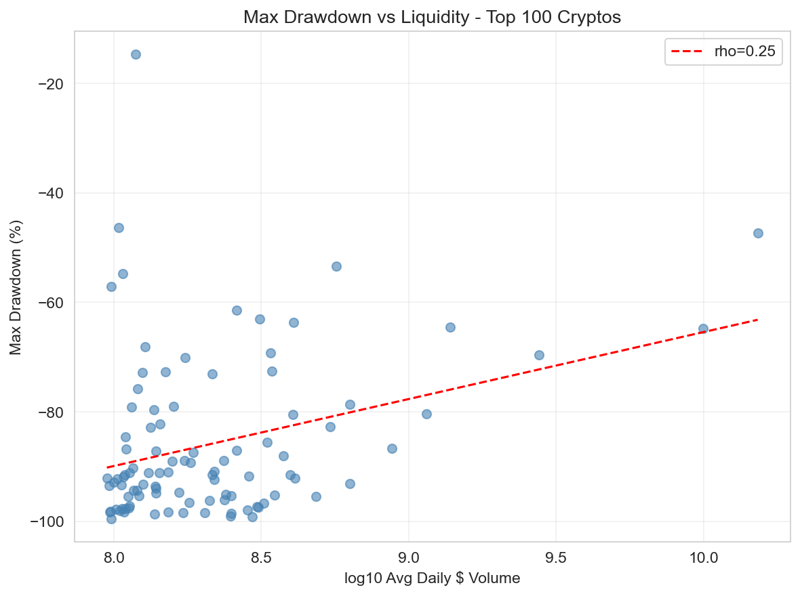

---

## EC9: BTC Intraday Volume Smile

### Findings

| Metric | Value |
|--------|-------|
| Peak hour (UTC) | **14:00** ($1,264M avg) |
| Trough hour (UTC) | **05:00** ($402M avg) |
| Peak/Trough ratio | **3.15x** |

**Volume by trading session:**

| Session | Hours (UTC) | Share |
|---------|-------------|-------|
| US | 14:00–21:00 | **44.8%** |
| Europe | 07:00–15:00 | **43.0%** |
| Asia | 00:00–07:00 | **25.0%** |

(Sessions overlap, so shares sum to >100%.)

### Does BTC Follow the US Equity Volume Smile?

**Partially, but not cleanly.** The US equity volume smile is a distinct U-shape: high at market open (9:30 AM ET), dipping at midday, and rising again at close (4:00 PM ET). BTC's intraday profile differs in key ways:

1. **No "close" spike.** Since crypto markets never close, there is no closing auction or end-of-day portfolio rebalancing pressure. Volume doesn't spike at 4 PM ET the way it does in equities.

2. **Broad "open" bulge rather than a sharp spike.** BTC volume rises when US markets open (14:00 UTC = 9:00 AM ET) and stays elevated throughout the US session. This reflects US institutional and retail participation but without the concentrated open/close dynamics.

3. **European overlap amplifies.** The peak volume hours (14:00–16:00 UTC) coincide with the overlap of European afternoon and US morning sessions, concentrating global activity.

4. **Asian session has material volume.** Unlike US equities (which see negligible non-US-hours activity), BTC maintains 25% of its volume during Asian hours. This reflects crypto's genuinely global, 24/7 nature.

5. **The pattern is more of a "single hump" than a "smile."** Volume builds through the European morning, peaks during US–European overlap, and gradually declines through the US afternoon and Asian night.

**Why?** The equity volume smile is driven by institutional mechanics: opening auctions, portfolio rebalancing, index reconstitution, and closing crosses. BTC lacks these structural features. Instead, its volume profile reflects the natural activity cycle of global time zones, with the US as the dominant marginal participant.

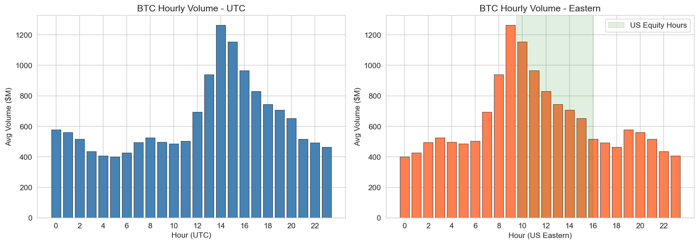

---

## References

1. Alexander, C. & Heck, D. (2020). "Price Discovery in Bitcoin: The Impact of Unregulated Markets." *Journal of Financial Stability*, 50, 100776.
2. Cong, L.W., Li, X., Tang, K. & Yang, Y. (2023). "Crypto Wash Trading." *Management Science*, 69(11), 6427–6454.
3. Gu, S., Kelly, B. & Xiu, D. (2020). "Empirical Asset Pricing via Machine Learning." *Review of Financial Studies*, 33(5), 2223–2273.
4. Hasbrouck, J. (1995). "One Security, Many Markets: Determining the Contributions to Price Discovery." *Journal of Finance*, 50(4), 1175–1199.
5. Jegadeesh, N. & Titman, S. (1993). "Returns to Buying Winners and Selling Losers: Implications for Stock Market Efficiency." *Journal of Finance*, 48(1), 65–91.
6. Korajczyk, R.A. & Sadka, R. (2004). "Are Momentum Profits Robust to Trading Costs?" *Journal of Finance*, 59(3), 1039–1082.
7. Sockin, M. & Xiong, W. (2023). "A Model of Cryptocurrencies." *Management Science*, 69(11), 6415–6426.
