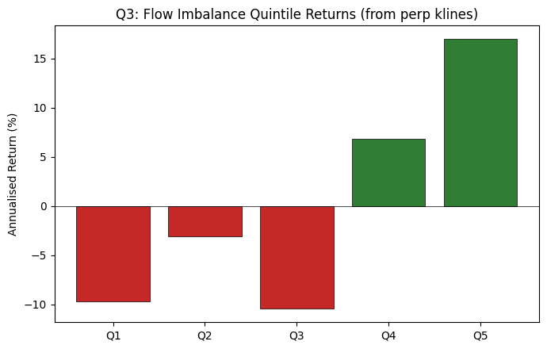
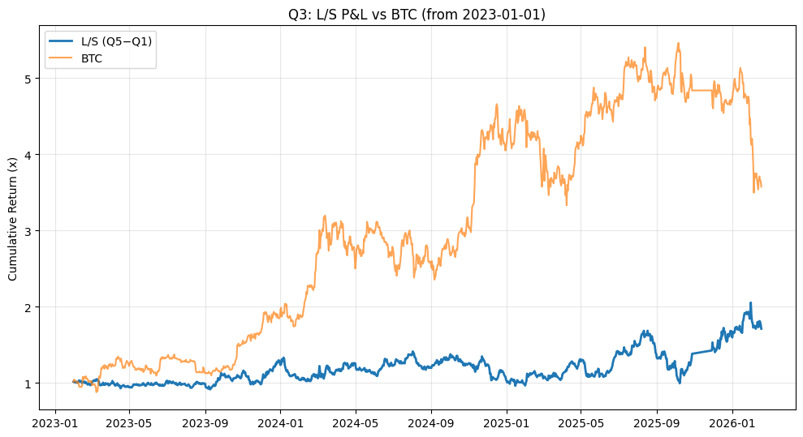

# Flow-Imbalance Long/Short Strategy (Perpetual Futures)

## Data and signal construction

We build a daily long/short strategy on Binance perpetual futures using **order-flow imbalance** as the signal. For each symbol *i* and day *t*, we aggregate all hourly perp klines and compute:

Formula: <b>flow_imbalance_1d(i, t)</b> = <b>sum_h taker_buy_quote_volume(i, t, h)</b> / <b>sum_h quote_volume(i, t, h)</b>.

- **Universe:** Top 100 symbols by trailing 30-day average dollar volume, recomputed each day from `daily_returns.parquet`. This focuses on liquid contracts and is similar to the liquidity filter used in the extra-credit analysis.
- **Signal date:** Day T. We use all hourly bars from 00:00–23:00 UTC to form flow_imbalance_1d(i, T).

## Trading timeline and implementation

The key implementation choice is **when** the signal is known relative to the traded return:

- The last hourly bar for day T (23:00-24:00 UTC) is available shortly after midnight at the start of **day T+1**.
- We therefore trade using **`ret_utc1` on day T+1**, which is the 24-hour return from 01:00 UTC T+1 to 01:00 UTC T+2.
- This creates at least a one-hour buffer between signal availability and the start of the traded return and avoids any look-ahead bias.

If we instead tried to trade on returns that start before the final bar of day T is known (for example, using `ret_utc0` on the same day), the backtest would implicitly see into the future and produce unrealistically high Sharpes. The `run_q3.py` code enforces the **T -> T+1** mapping by building a panel with `signal_date = sd` and `trade_date = sd + 1`.

## Portfolio construction and backtest

Each trading day from 2023-01-01 onwards:

- We keep only symbols in the top-100 liquidity universe on signal date T.
- We perform a **quintile sort** on flow imbalance:
  - **Q5:** highest buying pressure (most aggressive taker buys).
  - **Q1:** lowest buying pressure.
- Within each quintile, positions are **equal‑weighted**.
- The long/short portfolio is **long Q5, short Q1**, rebalanced daily.

Over the full sample the strategy delivers:

- Long/short (Q5-Q1):
  - Sharpe: 0.64
  - Annualised return: 26.6%
  - Annualised volatility: 41.3%
  - Cumulative return: 71.2%
  - Max drawdown: −40.9%

These statistics are read from `Q3/results/q3_metrics.txt` and match the base results reported in the extra-credit write-up. The quintile bar chart below shows a clear spread from deeply negative returns in Q1 to strongly positive returns in Q5, consistent with order flow containing predictive information for next-day returns.

The cumulative P&L chart compares the long/short strategy to BTC:

BTC experiences a larger overall run-up and bigger swings, while the market-neutral long/short strategy compounds steadily with smaller drawdowns. This behaviour is typical for cross-sectional factor portfolios.

## Factor exposure and BTC alpha

To understand how much of the performance is simply a disguised BTC bet, `run_q3.py` runs a daily regression of L/S returns on BTC returns:

Regression: <b>L/S_t</b> = <b>alpha</b> + <b>beta</b> * <b>r_BTC,t</b> + error_t.

From `q3_metrics.txt`:

- Annualised alpha: 32.6% per year.
- Beta to BTC: −0.11 (slightly short BTC overall).
- t-stat of alpha: 1.37.
- R^2: 1.6%.

The negative beta confirms that the strategy is not merely long the market; if anything it slightly hedges BTC. The alpha estimate is economically large but only marginally statistically significant over the sample, which is consistent with a noisy, high-volatility environment.

The assignment does not provide Fama-French factor data, and standard FF5 + MOM factors (SMB, HML, RMW, CMA, MOM) are constructed from equity markets and carry no direct meaning in crypto asset markets. We therefore do not run a traditional FF5 regression. Instead, we use a crypto-native proxy factor regression — regressing L/S returns on BTC, ETH, and an equal-weighted market return across the top-100 universe — as the appropriate analogue for factor exposure analysis.

### Crypto proxy factor regression (BTC, ETH, market)

As a robustness check we run a multi-factor regression of the L/S returns on BTC, ETH and an equal-weighted market return across the top-100 universe. The estimated daily alpha is about 0.00074 (roughly 27% annualised) with an R^2 around 4%, and small betas to all three factors (BTC ≈ 0.08, ETH ≈ −0.12, MktRF ≈ −0.04). This suggests that broad BTC/ETH/market moves explain only a small fraction of the strategy’s variance and that most of the performance reflects stock-selection across names rather than simple crypto beta exposure.

## Behaviour in the early‑2026 meltdown

To stress-test the strategy, we restrict the sample to **January-March 2026**, when the broader crypto market experienced a sharp drawdown. Over this window the long/short portfolio achieves:

- Sharpe: 0.55
- Annualised return: 33.3%
- Annualised volatility: 61.1%
- Cumulative return: 2.0%
- Max drawdown: −16.7%

While BTC suffers a substantial sell-off in this period, the market-neutral portfolio remains slightly profitable with substantially smaller drawdowns, highlighting that flow-imbalance captures relative-value opportunities that are less sensitive to broad market direction.

## Interpretation

Putting these pieces together:

- The **timing** of the signal (T -> T+1 with `ret_utc1`) ensures that the backtest is implementable and that strong performance is not an artefact of look-ahead.
- The **quintile pattern** and the long/short metrics suggest that daily order-flow imbalance is a meaningful predictor of next-day cross-sectional returns in liquid crypto perps.
- The strategy exhibits **moderate standalone Sharpe** with sizeable but manageable drawdowns, and it behaves relatively well during severe market stress, making it a plausible building block for a diversified quant portfolio.
