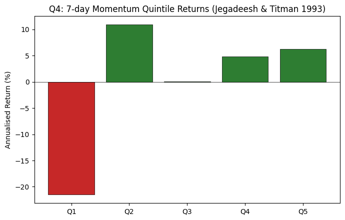
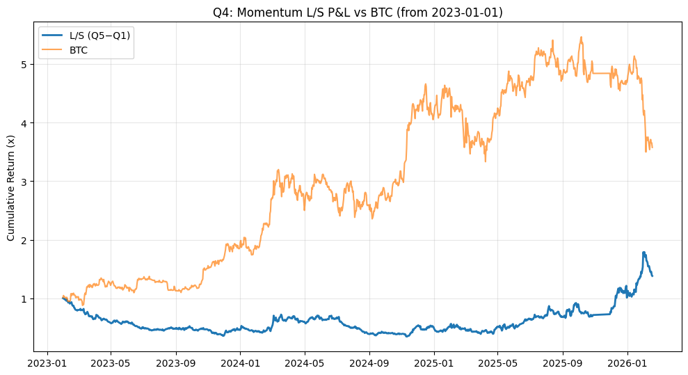

# Momentum-Based Long/Short Strategy (7-Day Lookback)

## Signal design and data

As an alternative to order-flow imbalance, we consider a **price-based momentum signal**. For each symbol *i* and date *t*, we define 7-day momentum using `close_utc1`:

Formula: <b>ret_7d(i, t)</b> = <b>close_utc1(i, t)</b> / <b>close_utc1(i, t-7)</b> - 1.

The universe and timing are kept identical to the flow-imbalance strategy:

- **Universe:** Top 100 symbols by trailing 30-day average dollar volume, refreshed daily (same liquidity screen as Q3).
- **Signal date:** Day T; we compute ret_7d(i, T) using only prices up to and including day T.
- **Traded return:** `ret_utc1` on day T+1, i.e. the 24-hour return from 01:00 UTC T+1 to 01:00 UTC T+2, preserving a one-hour buffer between signal and trade.

This ensures the momentum signal is **point-in-time** and directly comparable to the flow-imbalance implementation.

## Portfolio construction and performance

Each day from 2023-01-01 onwards we:

- Form **quintiles** on 7-day momentum within the liquidity-filtered universe.
  - **Q5:** strongest recent winners.
  - **Q1:** strongest recent losers.
- Construct an equal-weighted long/short portfolio that is **long Q5 and short Q1**, rebalanced daily.

From `Q4/results/q4_metrics.txt` the long/short (Q5-Q1) portfolio delivers:

- Sharpe: 0.48
- Annualised return: 27.8%
- Annualised volatility: 58.2%
- Cumulative return: 38.4%
- Max drawdown: −65.2%

The quintile bar chart below shows that the effect is largely driven by very negative returns in the loser bucket (Q1), while the winner buckets earn modestly positive returns:

The cumulative P&L relative to BTC is:

Compared with the flow-imbalance strategy, the momentum strategy achieves a somewhat lower Sharpe ratio and a meaningfully larger maximum drawdown, but still produces a respectable positive long-run return.

## Economic rationale and citations

The idea of buying past winners and selling past losers goes back to **Jegadeesh & Titman (1993)**, who document strong 3- to 12-month momentum effects in equities (“Returns to Buying Winners and Selling Losers: Implications for Stock Market Efficiency,” *Journal of Finance*, 48(1), 65-91). Subsequent work has adapted this framework to digital assets:

- **Drogen, Hoffstein & Otte (2024)**, “Cross-sectional Momentum in Cryptocurrency Markets” (SSRN 4322637), show that cross-sectional momentum portfolios constructed on liquid spot cryptocurrencies can outperform BTC when realistic liquidity screens are applied.

Our implementation follows the same spirit in a futures setting, but with a shorter 7-day lookback to keep the signal distinct from the flow-imbalance factor and aligned with the daily horizon of the assignment. The backtest confirms that short-term momentum continues to have predictive content in liquid crypto perps, although with higher tail risk than the order-flow strategy.

### Crypto proxy factor regression (BTC, ETH, market)

The assignment does not provide Fama-French factor data, and standard FF5 + MOM factors (SMB, HML, RMW, CMA, MOM) are constructed from equity markets and carry no direct meaning in crypto asset markets. We therefore do not run a traditional FF5 regression. Instead, we use a crypto-native proxy factor regression — regressing L/S returns on BTC, ETH, and an equal-weighted market return across the top-100 universe — as the appropriate analogue for factor exposure analysis.

In addition to a simple BTC-only alpha regression (reported in `q4_metrics.txt` under “BTC Alpha Regression”), we regress the momentum L/S returns on BTC, ETH and the same equal-weighted market factor. The proxy regression yields a daily alpha of roughly 0.00082 (about 30% annualised) with low explanatory power (R^2 ≈ 2%) and modest betas (small positive to BTC, slightly negative to ETH and MktRF). This indicates that while the strategy does load somewhat on broad crypto moves, a sizeable part of its performance cannot be explained by simple BTC, ETH or market exposure alone.

## Interpretation

Taken together with the flow-imbalance results and the proxy factor regressions, this exercise suggests that:

- **Price-based momentum** and **order-flow imbalance** are complementary ways of capturing directional pressure in crypto markets, each with residual alpha beyond basic BTC/ETH/market betas.
- The momentum strategy delivers a solid but more volatile return stream, driven largely by the underperformance of recent losers.
- In practice, a diversified portfolio that mixes order flow and momentum signals while carefully controlling turnover and drawdowns would likely be more robust than relying on either signal alone.
